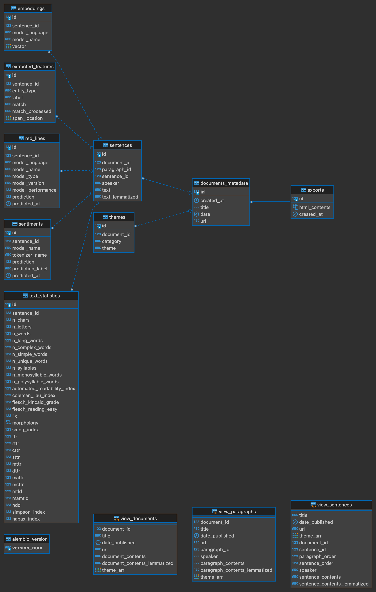

# speeches

This repository contains an app made with FastAPI, SQLModel, and Alembic. 
It's built to store text articles and their associated metadata in a Postgres database. Using natural language processing (NLP), the app extracts key data from the articles and also holds this information.

The app's design follows a multi-table structure in Postgres to efficiently manage and retrieve data. It revolves around several tables:

- `documents_metadata`: stores basic details of an article including its title and creation date.
- `embeddings`: holds vector representations of sentences, created through specific NLP models.
- `exports`: maintains HTML contents of articles (raw data).
- `extracted_features`: catalogs named entities and key noun phrases.
- `red_lines`: retains model predictions (text classifier) about certain aspects of sentences.
- `sentences`: holds the basic unit of an article, the sentence, and its lemmatized version.
- `sentiments`: records sentiment analysis results conducted on sentences.
- `text_statistics`: gathers numerous language complexity metrics on sentences.
- `themes`: keeps track of the broad topics that each article addresses.

The primary goal is to provide a well-structured, efficient way to hold and handle article data, making it easy to analyze and gain insights from.



---

## Usage (local development)

Before running docker-compose, make sure you have 
`.env` file with database credentials stored in 
the root directory. 

**env**:
```console
PROJECT_NAME=...
DESCRIPTION=...
SECRET_TOKEN=...
BACKEND_CORS_ORIGINS=["http://localhost:8000", "https://localhost:8000", "http://localhost", "https://localhost"]
POSTGRES_USER=...
POSTGRES_PASSWORD=...
POSTGRES_SERVER=host:port
POSTGRES_DB=...
```

**command**:
```console
docker-compose up -d --build
```